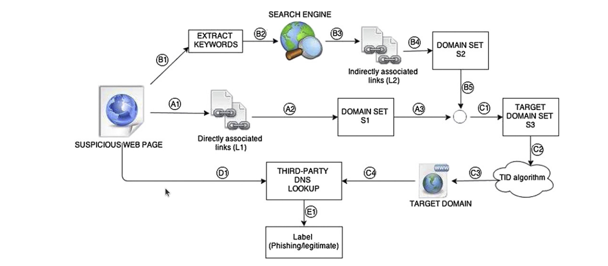
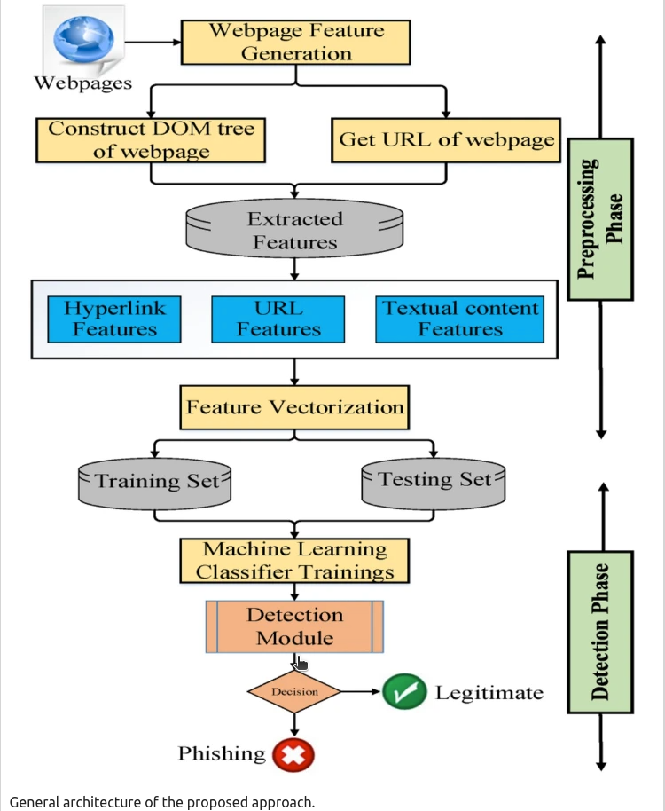

# Reseach Paper or Research Finding for Phishing detection System

## My Finding from all research paper which I studied?
                            
                Phishing Detection
                        |
                ________|________
                |               |
        Software Detections   User Training
        ________|
        |____ List Base
        |____ Visual Similarity
        |____ Heuristics and Machine Learning Based

### List Based Approach:

- White List Approach:
  - The white-list approach maintains a list of all safe websites and their associated information. Any website that does not appear in the list is treated as a suspicious website.
- Black List Approach:
  - The blacklist approach maintains a list of known phishing sites to
check the currently visiting website against the list. This blacklist is usually
gathered from multiple data sources like spam traps or spam filters, user
posts (e.g. phishtank) or verified phish compiled by third parties such as
takedown vendors or financial institutions

- Drawbacks of the approach:
  - This approach needs frequent updates from their sources and the exponential growth of the list demands great deal of system resources.

### Visual Similarity and Heuristics and Machine Learning Based
- The heuristic-based approaches extract one or more features from a
webpage to detect phishing instead of depending on any of precompiled
lists. Most of these features are extracted from URL and HTML DOM
(Document Object Model) of the suspicious webpage.

#### Few Approaches are discussed as follow:
- CANTINA
  - It is  based on the tf–idf
(term frequency and inverse document frequency) algorithm to identify
top ranking keywords from the page content and meta keywords/description tags.
  - These keywords are searched through a trusted search
engine such as Google. Here, a webpage is considered legitimate if the
page domain appears in the top N search results.

- Phishark
  -  In this research they have
analyzed and studied the characteristics of phishing attack and have
defined twenty heuristics to detect phishing webpages. These twenty
heuristics were then checked for the effectiveness to decide as to
which of these heuristics would play a major role in identifying both
the phishing and the legitimate webpages. [source](http://www-public.it-sudparis.eu/~lauren_m/articles/Paper-gastellier-decisive-heuristics-SARSSI11.pdf)
  - Drawback is this methods fall short in detecting a phishing webpage made up of only embedded objects like images and scripts.

- Earth Mover's Distance (EMD)
  - Measure
webpage visual similarity. In this approach they first convert the webpage
into low resolution images and then use color and coordinate features to
represent the image signatures. EMD is used to calculate the signature distances of the images of the webpages. They used trained EMD threshold
vector for classifying a webpage as a phishing or legitimate.*
  - Drawback is these techniques
may result in false positive when a legitimate page crosses the similarity
threshold value and also fails to identify the targeted page

- Multifaceted approaches 
  - Joshi developed the PhishGuard tool that identifies phishing websites by
submitting actual credentials after the bogus credentials during the
login process of a website. [source](https://sci-hub.se/10.1109/IMSAA.2008.4753929)

### Research Paper 1 approach :

- For a given suspicious page, our method first identifies all the direct
and indirect links associated with that page. 
- The links which are directly
associated with the webpage are extracted from the HTML source of the
page and grouped based on their domains, as a set of domain S1. 
- The indirectly associated links of the page are then retrieved by first extracting
the keywords in the webpage and feeding these keywords to a search engine. 
- We retrieve the first n links returned by the search engine as
indirectly associated links and group them as a second set of domain S2.
A reduced domain set S3 is constructed by extracting only the common
domains present in both S1 and S2. 
- This set S3 is fed as an input to a
[TID algorithm](https://www.philippe-fournier-viger.com/spmf/AprioriTID.php)* , to identify the phishing target domain. We use DNS lookup
to map the domain of the identified phishing target to its corresponding
IP address. 
- Similarly, we also map the domain of the suspicious webpage
to its corresponding IP address. On comparing the two IP addresses we
conclude the authenticity of the suspicious webpage.

[source](https://sci-hub.se/https://www.sciencedirect.com/science/article/abs/pii/S0167923614000037)

### Comparison among anti phising method:

### Research Paper 2 approach :
#### An effective detection approach for phishing websites using URL and HTML features

This paper proposes a new approach to solve the anti-phishing problem. The new features of this approach can be represented by URL character sequence without phishing prior knowledge, various hyperlink information, and textual content of the webpage, which are combined and fed to train the [XGBoost classifier](https://towardsdatascience.com/beginners-guide-to-xgboost-for-classification-problems-50f75aac5390). One of the major contributions of this paper is the selection of different new features, which are capable enough to detect [0-h attacks](), and these features do not depend on any third-party services.

#### Proposed Approach
Our approach extracts and analyzes different features of suspected webpages for effective identification of large-scale phishing offenses. The main contribution of this paper is the combined uses of these feature set. For improving the detection accuracy of phishing webpages, we have proposed eight new features. Our proposed features determine the relationship between the URL of the webpage and the webpage content.

#### System Architecture 

The overall architecture of the proposed approach is divided into three phases. In the first phase, all the essential features are extracted and HTML source code will be crawled. The second phase applies feature vectorization to generate a particular feature vector for each webpage. The third phase identifies if the given webpage is phishing. Figure shows the system structure of the proposed approach. Details of each phase are described as follows.

[source](https://www.nature.com/articles/s41598-022-10841-5)
